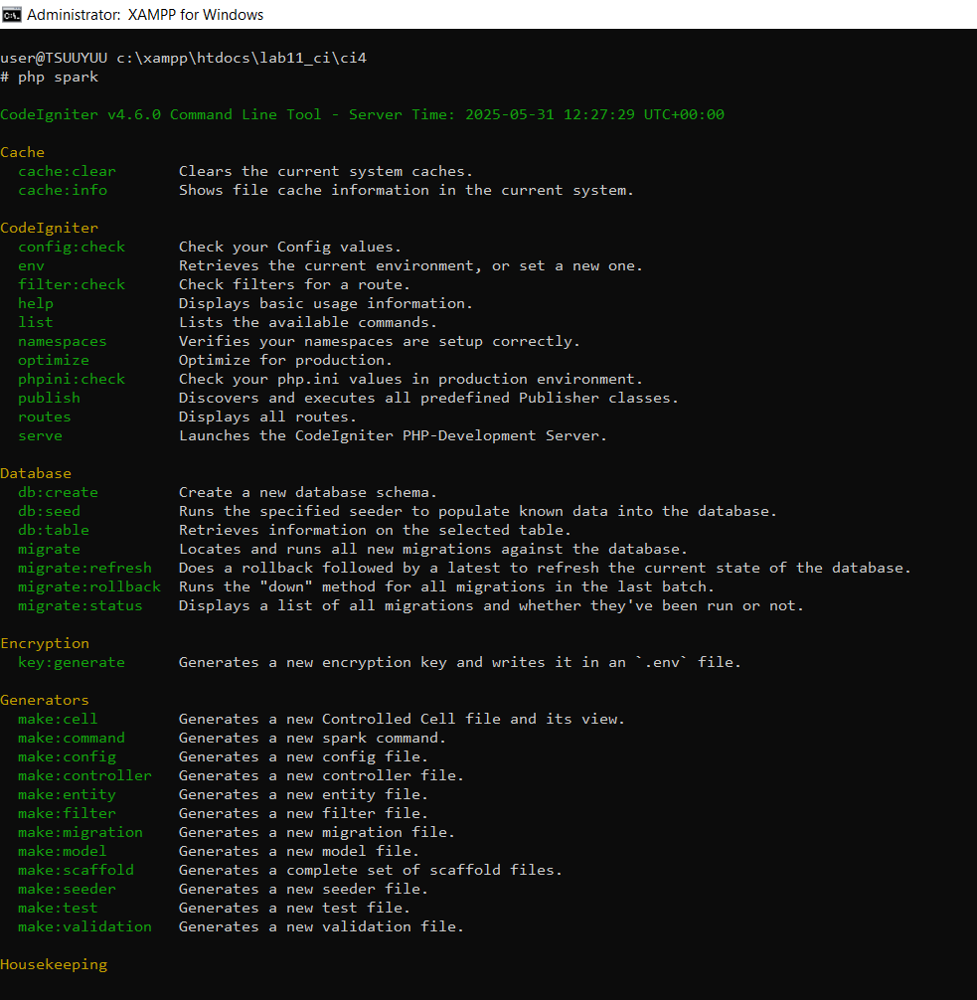
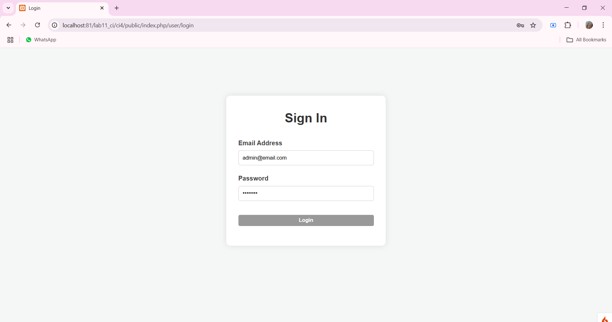
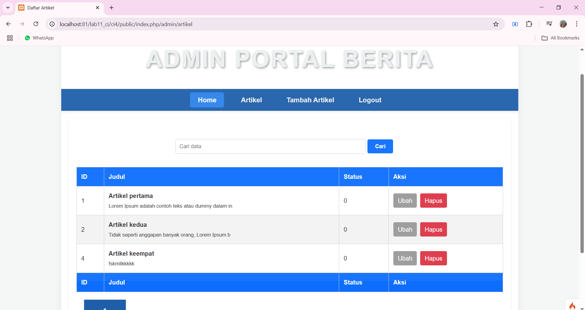

# 📘 Dokumentasi Project CodeIgniter 4 - Lab 11

## 🧕 Identitas

- **Nama**: Alisya Katsulya Syaukani 
- **NIM**: 312310046
- **Kelas**: TI.23.C1  
- **Mata Kuliah**: PEMOGRAMAN WEB 2  

---

## 📁 Deskripsi Singkat

Proyek ini dibuat hanya untuk memenuhi tugas Pemrograman Web 2.  

---

## 📸 Dokumentasi Langkah-langkah

> Semua screenshot hasil langkah-langkah disimpan dalam folder `screenshots/` di dalam proyek.

---

### 🔧 Praktikum 1: Setup Project CodeIgniter 4

1. **Konfigurasi Ekstensi di XAMPP**  
2. **Install CodeIgniter 4** 
  - Install dan ekstrak CodeIgniter 4 ke dalam folder `htdocs/lab11_ci/ci4`.

3. **Menjalankan CLI (Command Line Interface)**
  - Buka cmd jalankan perintah:
    ```bash
    php spark
    ```
 

4. **Menjalankan CodeIgniter 4**
  - Jalankan melalui `http://localhost/lab11_ci/ci4/public`
  

5. **Konfigurasi File .env**
  - Ubah nama file `env` menjadi `.env`
  - Set variabel berikut:
    ```
    CI_ENVIRONMENT = development
    ```
  

 6. **Membuat Route dan Controller**
   - Tambahkan route baru untuk halaman:
     - About
     - Contact
     - FAQs
   - Buat controller dengan nama yang sama (`About.php`, `Contact.php`, `Faqs.php`)

7. **Auto Routing**
  - ubah nilai `true` menjadi `false`
  - Tambah method baru pada Controller Page:
    ```bash
    public function tos()
    {
      echo "ini halaman Term of Service";
    }
    ```
8. **Membuat View** 
  - `app/view/about.php`

9. **Tambahkan CSS**
  

---

### 🔧 Praktikum 2: Framework Lanjutan (CRUD)

1. **Membuat Database dan Tabel**
- Buat databse
  ```bash
  CREATE DATABASE lab_ci4
  ```

  

2. **Konfigurasi Koneksi Database**
3. **Membuat Model : ArtikelModel.php**
4. **Membuat Controller : Artikel.php**
5. **Membuat View**
  - Buat direktori artikel di `app/views` lalu buat index.php
  
6. **Membuat Tampilan Detail Artikel**
  - Buat fungsi baru di Controller Artikel dengan nama view()
7. **Membuat View Detail**
  - `app/views/artikel/detail.php`
8. **Membuat Routing untuk Artikel Detail**

  - Tambahkan pada app/config/Routes.php
   
9. **Membuat Menu Admin**
   
10. **Menambah Data Artikel**
   
11. **Mengubah Data Artikel**
   
12. **Menghapus data**
  - tambah method di Controller Artikel dengan nama delete()

---

## Pratikum 3: View Layout dan View Cell

1. **Membuat page beranda menggunakan Layout Sederhana**


2. **Menambahkan View Cell**
 untuk menampilkan data dari database (menambahkan create_at)


## Manfaat Pakai View Layout

Pakai View Layout di CodeIgniter 4 itu sangat membantu untuk buat kerangka tampilan yang konsisten di seluruh halaman. Beberapa manfaat utamanya:

- **Minim duplikasi** — Header, footer, sidebar cukup ditulis sekali, dan bisa dipakai di semua halaman.
- **Lebih gampang maintenance** — Mau ubah tampilan? Cukup edit di satu file layout aja, gak perlu bongkar satu-satu.
- **Tampilan seragam** — Semua halaman punya gaya yang sama, jadi lebih profesional dan rapi dilihat.

---

## Bedanya View Cell vs View Biasa

### View Cell
- Komponen kecil dan bisa dipakai ulang (contoh: kartu produk, widget user, dll).
- Punya logika sendiri, gak perlu di-handle controller utama.
- Bisa dikasih parameter biar fleksibel tampilannya.

### View Biasa
- Dipakai buat nampilin satu halaman penuh atau bagian besar (misalnya: dashboard, daftar artikel).
- Butuh data dari controller utama.
- Fokus ke tampilan aja, gak punya logika terpisah.

---

 ## Pratikum 4: Modul Login

1. **Membuat tabel user**


2. **Membuat page login**
 


- User Membutukan login saat masuk ke page artikel



## Pratikum 5: Pagination dan Pencarian

1. **Membuat Pagination & Pencarian**



--


## Pratikum 6: Upload File Gambar

1. **Membuat Upload File Gambar**


--

## Praktikum 7: Relasi Tabel dan Query Builder 

1. **Membuat Tabel Kategori**


2. **Relasi Tabel di Tampilan Admin**


3. **Relasi Table Artikel dengan Kategori di Tampilan utama**


--

## Praktikum 7: Relasi Tabel dan Query Builder 

1. **Menambahkan Pustaka JQuery**
- Salin file jquery-3.7.1.min.js 
- Masukkan di Folder public/assets/js

2. **Relasi Tabel di Tampilan Admin**


3. **Relasi Table Artikel dengan Kategori di Tampilan utama**


