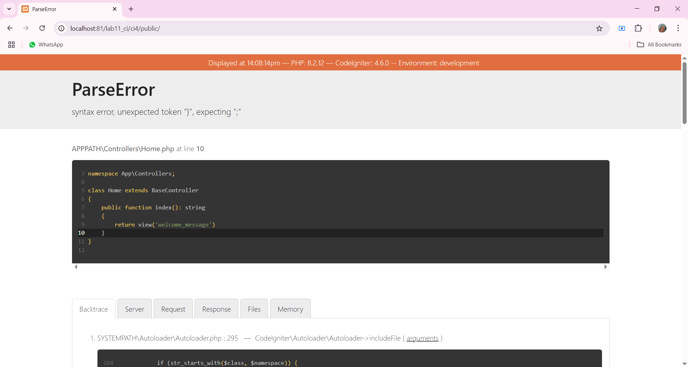
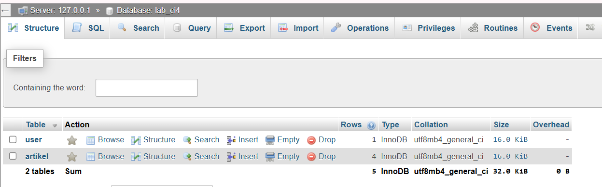

# 📘 Dokumentasi Project CodeIgniter 4 - Lab 11

## 🧕 Identitas

- **Nama**: Alisya Katsulya Syaukani 
- **NIM**: 312310046
- **Kelas**: TI.23.C1  
- **Mata Kuliah**: PEMOGRAMAN WEB 2  

---

## 📁 Deskripsi Singkat

Proyek ini dibuat hanya untuk memenuhi tugas Pemrograman Web 2.  

---

## 📸 Dokumentasi Langkah-langkah

> Semua screenshot hasil langkah-langkah disimpan dalam folder `screenshots/` di dalam proyek.

---

### 🔧 Praktikum 1: Setup Project CodeIgniter 4

1. **Konfigurasi Ekstensi di XAMPP**  
2. **Install CodeIgniter 4** 
  - Install dan ekstrak CodeIgniter 4 ke dalam folder `htdocs/lab11_ci/ci4`.

3. **Menjalankan CLI (Command Line Interface)**
  - Buka cmd jalankan perintah:
    ```bash
    php spark
    ```
 

4. **Menjalankan CodeIgniter 4**
  - Jalankan melalui `http://localhost/lab11_ci/ci4/public`
  

5. **Konfigurasi File .env**
  - Ubah nama file `env` menjadi `.env`
  - Set variabel berikut:
    ```
    CI_ENVIRONMENT = development
    ```
  

 6. **Membuat Route dan Controller**
   - Tambahkan route baru untuk halaman:
     - About
     - Contact
     - FAQs
   - Buat controller dengan nama yang sama (`About.php`, `Contact.php`, `Faqs.php`)

7. **Auto Routing**
  - ubah nilai `true` menjadi `false`
  - Tambah method baru pada Controller Page:
    ```bash
    public function tos()
    {
      echo "ini halaman Term of Service";
    }
    ```
8. **Membuat View** 
  - `app/view/about.php`

9. **Tambahkan CSS**
  


### 🔧 Praktikum 2: Framework Lanjutan (CRUD)

1. **Membuat Database dan Tabel**
- Buat databse
  ```bash
  CREATE DATABASE lab_ci4
  ```

  

2. **Konfigurasi Koneksi Database**
3. **Membuat Model : ArtikelModel.php**
4. **Membuat Controller : Artikel.php**
5. **Membuat View**
  - Buat direktori artikel di `app/views` lalu buat index.php
  
6. **Membuat Tampilan Detail Artikel**
  - Buat fungsi baru di Controller Artikel dengan nama view()
7. **Membuat View Detail**
  - `app/views/artikel/detail.php`
8. **Membuat Routing untuk Artikel Detail**

  - Tambahkan pada app/config/Routes.php
   
9. **Membuat Menu Admin**
   
10. **Menambah Data Artikel**
   
11. **Mengubah Data Artikel**
   
12. **Menghapus data**
  - tambah method di Controller Artikel dengan nama delete()


### 🔧 Praktikum 3: View Layout dan Viem Cell

1. **Membuat Layout Utama**